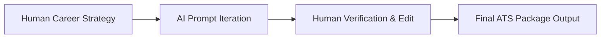

# AI Prompting & Job Search Automation Framework

A strategic guide for leveraging AI subagents, custom prompt sequences, and local background automation to streamline job discovery and document tailoring.

---

## 1. The Collaborative "Human + Coach + AI" Workflow

When deploying AI models to evaluate postings, tailor resumes, or draft cover letters, adhere to an iterative block-by-block generation model:

### Buzzword Elimination List
Purge generic AI filler words and overused buzzwords from all generated career documents:
* Avoid: *"Meticulously"*, *"Pioneered"*, *"Prowess"*, *"Realm"*, *"Helm"*, *"Testament"*, *"Synergy"*, *"Transformative"*, *"Innovative"*.
* Replace with concrete action statements and empirical numbers.

---

## 2. 7-Step AI Prompting Sequence

1. **Step 1: Role Context & Dissection**: Feed target job descriptions to the AI and prompt it to analyze hard requirements versus cultural traits.
2. **Step 2: Keyword Extraction**: Generate a list of top 15–20 technical and functional domain keywords matching the target posting.
3. **Step 3: Executive Summary Drafting**: Draft a 3-sentence summary incorporating core candidate strengths, target title, and organizational alignment.
4. **Step 4: Role Context Line**: Establish clear company scope and team responsibility lines for each employment position.
5. **Step 5: Iterative Bullet Customization**: Generate achievement bullets individually, applying the $\text{Verb} + \text{Scope} + \text{Result}$ formula.
6. **Step 6: Gap Analysis**: Prompt the AI to audit the draft resume against the target job posting to identify missing competencies.
7. **Step 7: Tone & Format Polish**: Perform final sanitization to enforce zero em dashes, single-column ATS layouts, and precise grammar.

---

## 3. Local API & Daemon Server Architecture

* **Background HTTP Server (`dashboard_server.py`)**: Listens silently on `http://localhost:5000` to handle 1-click package build triggers from local HTML dashboards (`dashboard.html`).
* **Silent Execution**: Auto-launches silently without displaying pop-up command windows (`subprocess.CREATE_NO_WINDOW`).
* **AppSec Compliance**: All email credentials and app passwords are loaded dynamically via environment variables (`.env`), disallowing hardcoded secrets. CORS headers restrict API access to trusted local origins (`http://localhost`, `127.0.0.1`, `file://`, `null`).
