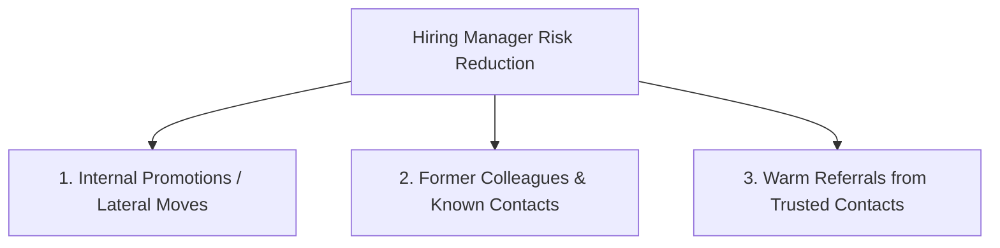

# Job Search Strategy & Networking Playbook

A structured, research-backed methodology for identifying high-fit career opportunities, dissecting job postings, and securing executive referrals through targeted outreach.

---

## 1. Dissecting Job Postings (Market Research)

Before drafting or customizing any application materials, dissect target job descriptions into two core buckets:

### Skill & Trait Matrix

| **Hard Technical Requirements** (Primary Focus) | **Culture & Behavioral Traits** (Secondary Focus) |
| :--- | :--- |
| • Required tools, platforms, and technical stack (e.g., Python, CMS platforms, SQL, MarTech tools). | • Operating style (e.g., fast-paced startup, highly regulated enterprise, matrixed team). |
| • Core functional responsibilities (e.g., revenue target ownership, P&L management, team leadership). | • Interpersonal characteristics (e.g., cross-functional collaborator, analytical communicator). |
| • Required educational background, certifications, or specialized domain expertise. | • Problem-solving approach (e.g., data-driven decision-making, customer-obsessed focus). |

### The 80% Rule
Candidates rarely meet 100% of listed qualifications in executive or senior postings. Matching ~80% of core technical duties and functional responsibilities provides a strong foundation to apply with confidence, as remaining gaps are typically addressed through strategic onboarding and transferable leadership experience.

---

## 2. The 3TC (3 Trustworthy Categories) Networking Strategy

Hiring involves financial and operational risk for employers. To minimize this risk, hiring managers prioritize candidates from **The 3 Trustworthy Categories (3TC)**:

### Outreach Workflows

#### Scenario A: Direct Connection (Prior Contact)
- **Action**: Contact the hiring manager or internal stakeholder *prior* to submitting your formal application.
- **Tone**: Request a 10–15 minute informational conversation to understand team priorities and growth objectives.
- **Protocol**: Send a concise thank-you note reiterating alignment after the chat, then submit your formal application.

#### Scenario B: Mutual Connection Referral
- **Action**: Request a warm email introduction from a shared colleague or mutual connection.
- **Protocol**: Respond immediately (within minutes) using "Reply All" to thank your mutual contact and request a brief conversation with the hiring manager.

#### Scenario C: Cold Executive Outreach
1. **Target Identification**: Build a curated list of 3–5 functional leaders (VP, Director, Head of) at the target organization using LinkedIn, industry directories, or organizational mapping tools.
2. **Initial Outreach**: Send a personalized connection message focused on learning about their organizational strategy and team growth.
3. **Informational Interview Structure**:
   - Limit the conversation to 15 minutes.
   - Focus on asking insightful questions about market challenges, technology choices, and leadership philosophy.
   - Follow up with a written thank-you note within 12 hours.

---

## 3. Remote vs. Hybrid Location Targeting

* **100% Remote Target Scope**: Focus on nationwide remote roles matching target domain expertise and compensation goals.
* **Regional / Local Hybrid Target Scope**: Restrict hybrid or on-site targets strictly to your local commuting metropolitan area (e.g., within a 30-mile radius or defined regional market).
