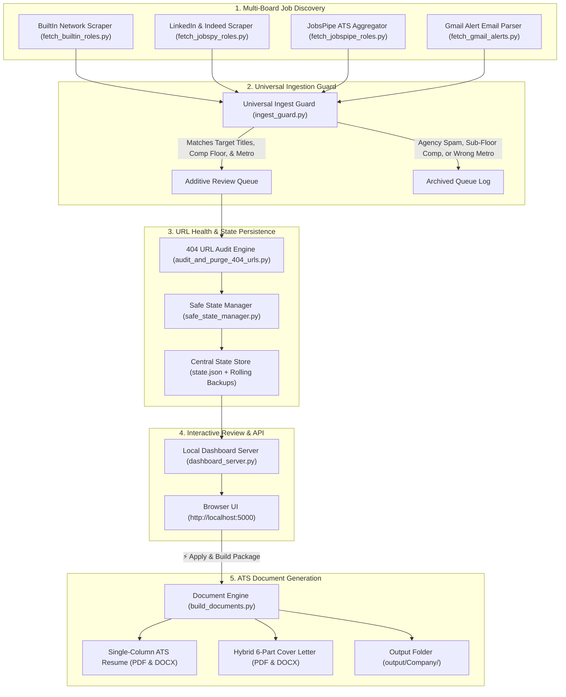

# 🎯 YACareerOps

[](https://www.python.org/)
[](LICENSE)
[](https://semver.org/)
[](#-system-architecture)

---

## 🖼️ System Interface Mockup

<p align="center">
  
</p>

---

## 💡 Overview

**YACareerOps** is a local, privacy-first career automation platform. It combines live multi-board scraping (BuiltIn, LinkedIn, Indeed), ATS API ingestion (Greenhouse, Lever, Ashby, Workday), dynamic Gmail alert digest parsing, universal guardrail filtering, a local background web dashboard, and 1-click tailored ATS resume and cover letter generation into a single Python system.

> [!NOTE]
> **Human-in-the-Loop Safeguard**: Clicking **"⚡ Apply & Build Package"** builds your tailored single-column ATS PDF/DOCX resume and hybrid cover letter locally. It **does not** automatically submit forms on external job sites. You maintain 100% control to review your customized package before submitting it directly to the employer's portal.

---

### Key Capabilities

- **Multi-Board Job Scraping**: Automated live extraction via **BuiltIn**, **LinkedIn & Indeed** (powered by `python-jobspy`), and **JobsPipe API** (Greenhouse, Lever, Ashby, Workday) with zero recruiter markup.
- **Universal Ingestion Guard**: Multi-factor filtering engine enforcing target titles, leadership seniority levels, geographic guardrails (100% Remote or preferred local metro), and compensation floors loaded from `config.json`.
- **IMAP Digest Alert Parser**: Connects to Gmail via secure IMAP to extract and validate job listings delivered by LinkedIn and Indeed email alerts.
- **Atomic Safe State Persistence**: Non-destructive state manager (`safe_state_manager.py`) with atomic file writes, automatic timestamped backup rotation, and zero silent drops.
- **Automated 404 URL Auditing**: Multi-threaded HTTP status verification engine (`audit_and_purge_404_urls.py`) that checks and purges dead or expired job links from the queue.
- **Local Web Dashboard & REST API**: Lightweight Flask server (`dashboard_server.py`) running on `http://localhost:5000` with an interactive split-pane interface to review vetted roles, dismiss irrelevant postings, and track active applications.
- **ATS Master Document Builder**: Document engine (`build_documents.py`) generating clean, single-column ATS Word (`.docx`) and PDF (`.pdf`) application packages with strict zero em-dash enforcement.

---

## ⚙️ How It Works: What Happens When You Click "⚡ Apply & Build Package"?

When you review your job queue on `http://localhost:5000` and click **"⚡ Apply & Build Package"**:

1. **API Trigger**: The web dashboard sends a POST request to your local background daemon server (`http://localhost:5000/api/apply`).
2. **Document Tailoring**: The master package builder (`build_documents.py`) reads the candidate profile from `config.json` and requirements from `state.json`.
3. **File Generation**: Generates customized application files inside your local export directory (`output/[Company_Name]/`):
   - Single-Column ATS Resume (`.pdf`)
   - Editable ATS Resume (`.docx`)
   - Tailored 6-Part Hybrid Cover Letter (`.pdf`)
   - Editable Cover Letter (`.docx`)
4. **State Tracker Update**: Updates `state.json`, moving the role from the review queue into active tracked applications.
5. **Manual Submission**: You open the generated folder, review the tailored documents, and submit directly to the employer's application portal.

---

## 🏗️ System Architecture



---

## 🛡️ AppSec & Privacy Standards

- **Environment Secrets**: Credentials and passwords are loaded strictly via environment variables (`os.environ`) or untracked local `.env` files.
- **Zero Remote Tracking**: All candidate state data (`state.json`) and generated application packages remain stored locally on your filesystem.
- **Strict Sanitization**: Text engines enforce a strict zero em-dash policy (` - ` stripped to hyphens or commas) to protect formatting across enterprise ATS parsers.

---

## 📦 Quickstart & Setup

### 1. Prerequisites
- Python 3.10 or higher
- Git

### 2. Clone the Repository
```bash
git clone https://github.com/Cask-Hound-Digital/job_search_agent.git
cd job_search_agent
```

### 3. Install Dependencies
```bash
pip install -r requirements.txt
```

### 4. Configure Your Profile & Search Targets
Open `config.json` and customize your target titles, salary floor, and metro locations:
```json
{
  "candidate": {
    "full_name": "Jane Doe",
    "email": "jane.doe@example.com",
    "phone": "(555) 012-3456",
    "min_salary_floor": 180000,
    "target_salary_baseline": 200000,
    "primary_location": "New York, NY",
    "workplace_preferences": ["Remote", "Hybrid"],
    "allowed_local_cities": ["new york", "brooklyn", "manhattan", "jersey city"]
  },
  "search_matrix": {
    "target_titles": [
      "Director of Product Management",
      "Director of Software Engineering",
      "VP of Technology"
    ],
    "excluded_titles": [
      "intern",
      "junior",
      "call center",
      "sales manager"
    ]
  }
}
```

### 5. Configure Environment Variables
Copy `.env.example` to `.env` and fill in your credentials:
```bash
cp .env.example .env
```

```env
GMAIL_USER=your_email@gmail.com
GMAIL_APP_PASSWORD=your_app_password
JOBSPIPE_API_KEY=your_key_optional
```

---

### 🖥️ Operating Modes

#### Mode A: Standalone Python CLI & Web Dashboard

1. **Run Unified Multi-Board Ingestion**:
   ```bash
   python run_unified_search.py
   ```
2. **Launch the Local Dashboard**:
   ```bash
   python dashboard_server.py
   ```
3. **Review & Build Packages**:
   Open `http://localhost:5000` in your browser. Review vetted roles and build customized ATS packages locally.

#### Mode B: Antigravity Agent & Background Scheduler

When running inside Google Antigravity:
1. Load the `job-search-consultant` skill located in `.agents/skills/job-search-consultant/`.
2. Schedule a recurring search cycle:
   ```bash
   /schedule CronExpression="0 7,11,15 * * *" Prompt="Execute multi-board search cycle and sync dashboard."
   ```

---

## 🏷️ Release Versioning Policy & Governance

YACareerOps follows [Semantic Versioning (SemVer 2.0.0)](https://semver.org/).

| Release Tier | Version | Description |
| :--- | :--- | :--- |
| **Major Release** | `v2.0.0` | Modular multi-board search architecture (BuiltIn, JobSpy, JobsPipe, IMAP), Universal Ingestion Guard, 404 URL auditor, atomic safe state manager, and local Flask dashboard. |
| **Minor Release** | `v1.2.0` | LinkedIn 1st-Degree connections engine, mobile alert dispatcher, and background daemon auto-launch. |
| **Patch Release** | `v1.0.1` | ATS single-column formatting fixes, location filter adjustments, and text sanitization. |

---

## 📄 License

This project is open-source software licensed under the [MIT License](LICENSE).
