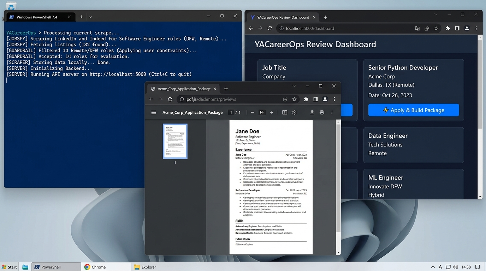
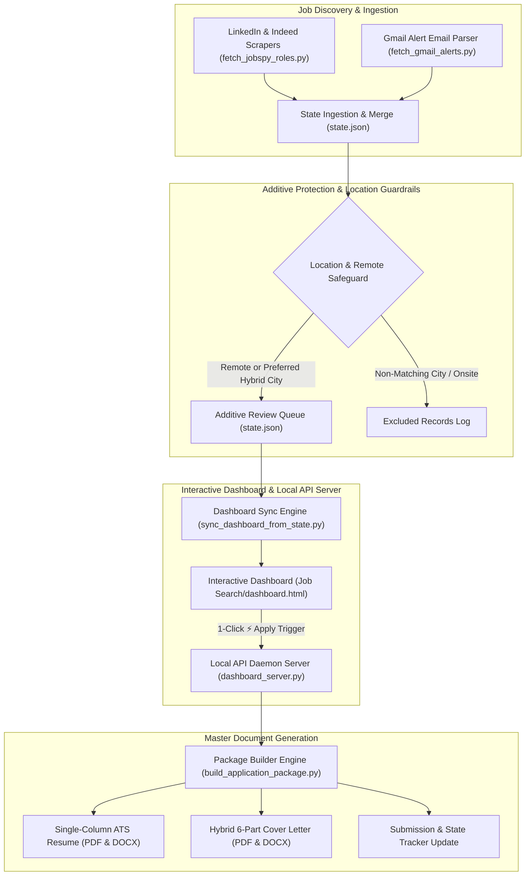

# ⚡ YACareerOps: Yet Another CareerOps Agent

**An autonomous open-source job search agent, multi-board scraper, local HTTP API daemon server, and 1-click ATS application package builder.**

---

[](LICENSE)
[](https://www.python.org/)
[](#-system-architecture)

---

## 🎥 3-Second Visual Demo



*Side-by-side terminal scraper sweeps (LinkedIn & Indeed), local HTTP API review dashboard with 1-Click "⚡ Apply & Build Package", and generated ATS PDF/DOCX application packages.*

---

## 🚀 Overview

**YACareerOps** is a local, privacy-first career automation system. It combines live open-source web scraping (LinkedIn, Indeed), dynamic email alert parsing, local background API server execution, and 1-click tailored resume & cover letter package generation into a single Python platform.

### Key Capabilities
- **Multi-Board Job Scraping**: Open-source scraper engine ([`fetch_jobspy_roles.py`](fetch_jobspy_roles.py)) extracting live listings from LinkedIn and Indeed with zero third-party API fees.
- **Strict Location Guardrail Filtering**: Validates geographic location strings and remote flags (`is_remote=True`) to automatically filter out non-matching onsite postings.
- **Silent Background API Server**: Local HTTP daemon server ([`dashboard_server.py`](dashboard_server.py)) running on `http://localhost:5000` with origin-validated CORS security.
- **Responsive HTML Review Dashboard**: Interactive HTML dashboard ([`sync_dashboard_from_state.py`](sync_dashboard_from_state.py)) rendering live job queues with a 1-click **"⚡ Apply & Build Package"** button.
- **ATS Master Document Builder**: Single document engine ([`build_application_package.py`](build_application_package.py)) generating single-column ATS PDF and DOCX resumes alongside 6-part hybrid cover letters.

---

## 🏗️ System Architecture



---

## 🛡️ AppSec & Security Standards

- **Environment Secrets**: Credentials and passwords are loaded strictly via environment variables (`os.environ`) or untracked local `.env` files.
- **CORS Protection**: The background server (`dashboard_server.py`) explicitly validates origin headers, allowing requests only from trusted local origins (`http://localhost`, `http://127.0.0.1`, `file://`, `null`).
- **Privacy-First Storage**: All candidate state data (`state.json`) and generated application packages are stored locally on your filesystem.

---

## 📦 Quickstart & Installation

### 1. Prerequisites
- Python 3.10 or higher
- Git

### 2. Clone the Repository
```bash
git clone https://github.com/Cask-Hound-Digital/job_search_agent.git
cd job_search_agent
```

### 3. Install Dependencies
```bash
pip install -r requirements.txt
```

### 4. Configure Environment Variables
Copy `.env.example` to `.env` and fill in your candidate details:
```bash
cp .env.example .env
```

### 5. Launch the System
Start the local API daemon server and run a job board sweep:
```bash
python dashboard_server.py
python fetch_jobspy_roles.py
```

Open `Job Search/dashboard.html` in your browser to view your live job review queue and click **"⚡ Apply & Build Package"**.

---

## 📄 License

This project is open-source software licensed under the [MIT License](LICENSE).
