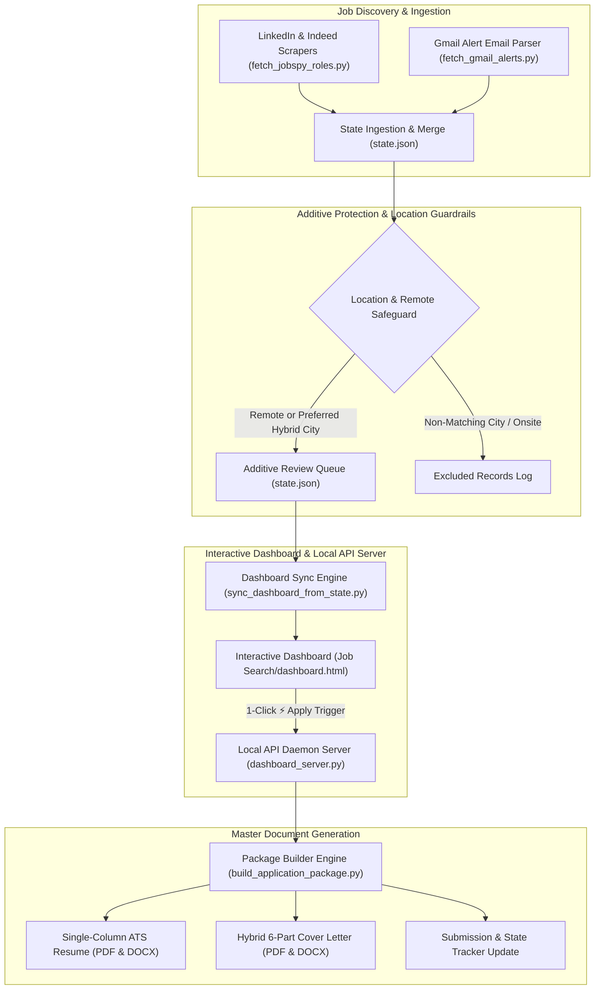

# ⚡ YACareerOps: Yet Another CareerOps Agent

**An autonomous open-source job search agent, multi-board scraper, local HTTP API daemon server, and 1-click ATS application package builder.**

---

[](LICENSE)
[](https://www.python.org/)
[](#-system-architecture)
[](https://www.buymeacoffee.com/roadrashtx)

---

## 🖼️ System Interface Mockup


*System Interface Mockup: Windows PowerShell terminal scraper logs, local HTTP API review dashboard with 1-Click "⚡ Apply & Build Package", and generated ATS PDF/DOCX application packages.*

---

## 🚀 Overview

**YACareerOps** is a local, privacy-first career automation system. It combines live open-source web scraping (LinkedIn, Indeed), dynamic email alert parsing, local background API server execution, and 1-click tailored resume & cover letter package generation into a single Python platform.

> [!NOTE]
> **Human-in-the-Loop Safeguard**: Clicking **"⚡ Apply & Build Package"** builds your tailored single-column ATS PDF/DOCX resume and 6-part hybrid cover letter locally. It **does not** automatically submit forms on external job sites. You maintain 100% control to review your customized package before submitting it directly to the employer's portal.

### Key Capabilities
- **Multi-Board Job Scraping**: Open-source scraper engine ([`fetch_jobspy_roles.py`](fetch_jobspy_roles.py)) extracting live listings from LinkedIn, Indeed, BuiltIn, and Dice with zero third-party API fees.
- **🤝 LinkedIn 1st-Degree Connections Engine**: Automatically matches target companies against your exported `Connections.csv` file, displaying 1st-degree network badges and pre-filled 3TC warm outreach templates for instant networking.
- **Strict Location & Title Safeguards**: Validates geographic location strings, remote flags (`is_remote=True`), and hard-excludes individual contributor engineering/PM titles to enforce executive profile rules.
- **Instant Mobile Push Notifications**: Integrated Telegram Bot dispatcher ([`send_job_alert.py`](send_job_alert.py)) delivering real-time mobile alerts for `🔥 FRESH (<24H)` job postings directly to your phone.
- **Silent Background API Server & Tailscale Support**: Local HTTP daemon server ([`dashboard_server.py`](dashboard_server.py)) running on port 5000 with dynamic origin binding (`window.location.origin`) for remote access over Tailscale.
- **Responsive HTML Review Dashboard**: Interactive HTML dashboard ([`sync_dashboard_from_state.py`](sync_dashboard_from_state.py)) rendering live job queues with a 1-click **"⚡ Apply & Build Package"** button.
- **ATS Master Document Builder**: Single document engine ([`build_application_package.py`](build_application_package.py)) generating single-column ATS PDF and DOCX resumes alongside 6-part hybrid cover letters.

---

## ⚙️ How It Works: What Happens When You Click "⚡ Apply & Build Package"?

When you review your job queue on `http://localhost:5000/dashboard.html` and click **"⚡ Apply & Build Package"**:

1. **API Trigger**: The HTML dashboard sends a POST request to your local background daemon server (`http://localhost:5000/api/apply`).
2. **Document Tailoring**: The master package builder ([`build_application_package.py`](build_application_package.py)) reads the candidate profile and job requirements from `state.json`.
3. **File Generation**: Generates 4 customized files inside your local export directory (`Job Search/[Company_Name]/`):
   - Single-Column ATS Resume (`.pdf`)
   - Editable ATS Resume (`.docx`)
   - Tailored 6-Part Hybrid Cover Letter (`.pdf`)
   - Editable Cover Letter (`.docx`)
4. **State Tracker Update**: Updates `state.json`, marking the role status as `"applied"` so it moves out of your active review queue.
5. **Manual Application**: You open the generated folder, review the customized documents, and upload them directly to the employer's application portal.

---

## 🏗️ System Architecture



---

## 🛡️ AppSec & Security Standards

- **Environment Secrets**: Credentials and passwords are loaded strictly via environment variables (`os.environ`) or untracked local `.env` files.
- **CORS Protection**: The background server (`dashboard_server.py`) explicitly validates origin headers, allowing requests only from trusted local origins (`http://localhost`, `http://127.0.0.1`, `file://`, `null`).
- **Privacy-First Storage**: All candidate state data (`state.json`) and generated application packages are stored locally on your filesystem.

---

## 📦 Quickstart & Operating Modes

### 1. Prerequisites
- Python 3.10 or higher
- Git

### 2. Clone the Repository
```bash
git clone https://github.com/Cask-Hound-Digital/job_search_agent.git
cd job_search_agent
```

### 3. Install Dependencies
```bash
pip install -r requirements.txt
```

### 4. Configure Environment Variables
Copy `.env.example` to `.env` and fill in your credentials:
```bash
cp .env.example .env
```

#### Optional: Enable Instant Mobile Telegram Push Alerts
1. Open Telegram and search for `@BotFather` to create a bot (`/newbot`). Copy the bot token.
2. Search for `@userinfobot` on Telegram and tap **Start** to get your personal Chat ID.
3. Open Telegram and send `/start` to your newly created bot so it has permission to send you messages.
4. Add your secrets to `.env`:
   ```env
   TELEGRAM_BOT_TOKEN=your_bot_token_from_botfather
   TELEGRAM_CHAT_ID=your_chat_id_from_userinfobot
   ```
   > [!IMPORTANT]
   > Your `.env` file is git-ignored and local-only. Never commit or push secret API tokens or Chat IDs to public repositories.

---

### 🖥️ Operating Mode A: Standalone Python & Local Server

1. **Start the API Daemon Server**:
   ```bash
   python dashboard_server.py
   ```
2. **Run a Multi-Board Job Sweep**:
   ```bash
   python fetch_jobspy_roles.py
   ```
3. **Review & Build Packages**:
   Open `Job Search/dashboard.html` in your browser. Click **"⚡ Apply & Build Package"** on any job card to generate customized ATS documents locally.

---

### 🤖 Operating Mode B: Google Antigravity Agent & Background Cron

When running inside the **Google Antigravity IDE**:

1. **Skill Integration**: Load the `job-search-consultant` skill located in `.agents/skills/job-search-consultant/`.
2. **Automated Cron Schedule**: Set an automated background schedule (e.g. `/schedule` or background cron) to execute business hours search cycles (7 AM – 5 PM CT every 4 hours):
   * Automatically executes `fetch_jobspy_roles.py` and `fetch_gmail_alerts.py`.
   * Auto-launches `dashboard_server.py` silently in the background (`CREATE_NO_WINDOW`).
   * Updates `state.json` and syncs `dashboard.html` for hands-free job queue updates.

---

## ☕ Support the Project

If YACareerOps helps you streamline your job search or build tailored applications, feel free to support the project:

[](https://www.buymeacoffee.com/roadrashtx)

---

## 🙏 Acknowledgements

- **[JobSpy](https://github.com/BobsData/JobSpy)**: Powered by the open-source `python-jobspy` multi-board scraper engine for live $0-cost extraction from LinkedIn and Indeed.
- **[ReportLab](https://www.reportlab.com/) & [python-docx](https://python-docx.readthedocs.io/)**: Single-column ATS document rendering engine.

---

## 🏷️ Release Versioning Policy & Governance

YACareerOps follows [Semantic Versioning (SemVer 2.0.0)](https://semver.org/).

| Release Tier | Version Example | When to Cut a New Release |
| :--- | :--- | :--- |
| **Major Release** | `v2.0.0` | Architectural shifts, breaking changes to core schemas/data structures, or major framework migrations (e.g. migrating from single-agent scrapers to full Antigravity 2.0 SDK multi-agent orchestration). |
| **Minor Feature Release** | `v1.2.0` | New user-facing capabilities, tools, or integrations added without breaking existing workflows (e.g. LinkedIn 1st-Degree Connections Engine, Tailscale Remote Access, 4-Hour Cron Engine). |
| **Patch Release** | `v1.2.1` | Bug fixes, scraper rate-limit adjustments, location/title exclusion updates, or minor UI/CSS visual polishes. |

---

## 📄 License

This project is open-source software licensed under the [MIT License](LICENSE).
